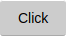

# Simple-Button.CSS
A simple low-code library for quick embedding and developement.

The library is so small there is no download. Just embed it with CDN:<br>
```
<link rel='stylesheet' type='text/css' href='//cdn.jsdelivr.net/gh/Parking-Master/Simple-Button@latest/sbtn.min.css' />
```

## How to use it
```
<click>Button!</click>
```
## What it looks like

